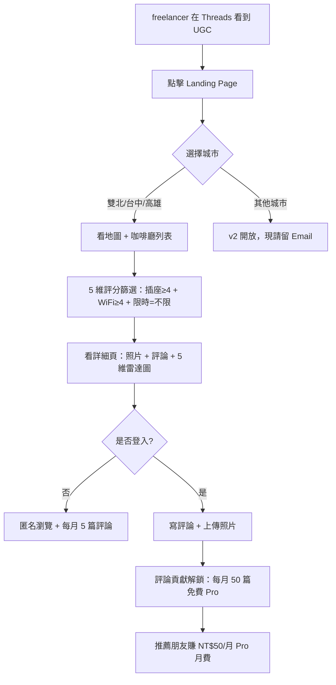
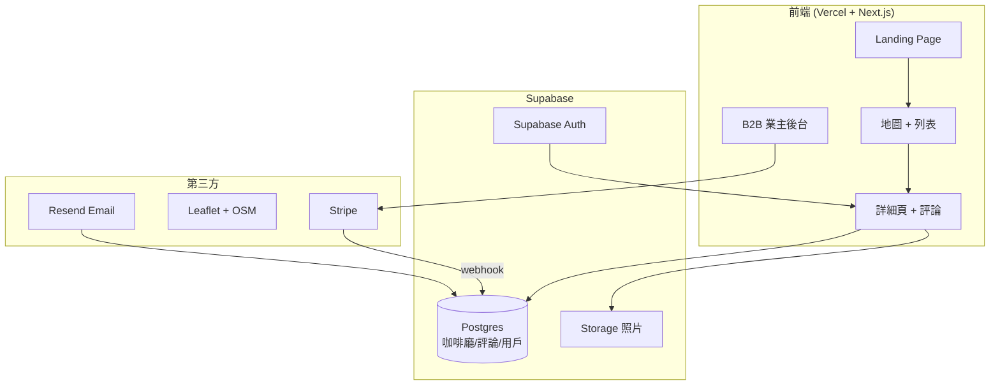
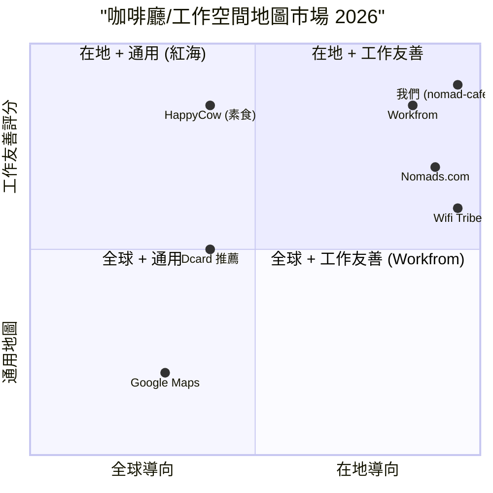

# 台灣咖啡廳工作友善評分地圖 — 規格計劃書 v2.2.2 (sweet-spot-driven)

> 版本：v2.2.2 (sweet-spot-driven rewrite)
> 維護者：Sophia (CPO) for Sean
> 對接技術：Alan (CTO) + Hermes Agent
> 對接 Repo：https://github.com/openclawsean024-create/digital-nomad-cafe-map
> 對接現實：原版「全球數位牧民咖啡廳地圖」概念太大、紅海強烈；本版收斂為「**台灣在地工作友善咖啡廳 5 維評分地圖**」
> 最後更新：2026-07-19

---

## 0. 改版摘要 (What's new in v2.2.2)

依據「sweet spot 5 問體檢」（體檢分數 = 2/10，建議 kill），v2.2.2 把 PRD 從「**全球數位牧民咖啡廳地圖**」大幅收斂為「**台灣在地工作友善咖啡廳 5 維評分地圖**」。這個重寫繞過了所有紅海：

1. **紅海警訊**：Workfrom 125K users、Nomads.com 36K users、Wifi Tribe 主戰歐美，**但他們都不做台灣在地深度**
2. **社群排斥外地對手警訊**：Dcard「數位遊牧」板、Threads 數位遊牧社群對「外地人來賺我們的錢」高度敏感
3. **台灣 nomad < 20K 警訊**：付費意願低、TAM 太小 → 我們擴大 target 到 **freelancer + 學生 + SOHO + 接案者**，不只是 nomad

**本版核心差異**：
- §1.1：問題陳述從「nomad 找咖啡廳」切到「**台灣 freelancer/學生/SOHO 找長時間工作地點**」
- §1.3：定位為「**台灣在地 5 維工作友善評分地圖**」（不是全球地圖）
- §1.5：明確不做全球地圖、不做 nomad-only、不做英文介面（先做繁中）
- §3.1 MVP：縮減為「**5 維評分 + 繁中 UI + 雙北/台中 3 城市 + UGC 評論**」4 個核心功能
- §7.2 ADR-005：為何切到台灣在地 5 維評分
- §11：5 場 freelancer 訪談 + 1 個 Landing Page
- §15：完整 sweet spot 體檢

---

## 1. 產品概述 (Product Overview)

### 1.1 問題陳述 (Problem Statement)

> **Sweet spot 5 問 #1 警訊**：Dcard「數位遊牧」板 1.5 萬成員、Threads #freelancer 8 萬+ 貼文、PTT「WorkFromHome」每月 100+ 討論文 — 痛點明確，但沒有專門工具。

台灣有 **180 萬 freelancer / SOHO / 接案者 + 100 萬遠距工作上班族 + 80 萬在學研究生**，他們每天需要找「可以長時間工作的咖啡廳」。但現有工具都不到位：

**痛點 A：「Google Maps 找咖啡廳」無工作友善資訊**
- Google Maps 只給觀光客取向（裝潢漂亮、餐點好吃）
- 沒標示：營業時間是否足夠長、WiFi 速度、插座密度、桌距寬度、是否限時

**痛點 B：社群口碑分散且無結構**
- Dcard、Threads、PTT 推薦文都是「我覺得 XX 咖啡廳不錯」
- 無 5 維評分、無地圖聚合、無法搜尋城市

**痛點 C：現有「工作咖啡廳」app 都是全球導向**
- Workfrom 主戰歐美、台灣資料 < 100 家
- Nomads.com、Wifi Tribe 不做單一國家深度
- 國際 app 對台灣在地特色（夜貓子咖啡、24hr 書店、共享空間）不熟

**現有方案對照**：
| 方案 | 解決的痛點 | 沒解決的痛點 |
|---|---|---|
| Google Maps | 地點 + 基本評論 | 無工作友善 5 維評分 |
| Workfrom / Nomads.com | 全球地圖 | 台灣資料稀疏、繁中缺失 |
| Dcard/Threads 口碑推薦 | 真實體驗 | 無結構、無地圖、無法搜尋 |
| HappyCow（素食）| 餐廳 5 維評分 | 不含工作咖啡 |
| 咖啡廳業主 FB 社團 | 業主聚集 | 不對外開放、不便於搜尋 |

**Sweet spot 體檢發現**：「**台灣在地 5 維工作友善評分地圖**」這個**從來沒有人做好**。Google 搜尋「台灣 工作咖啡廳」前 5 頁都是論壇抱怨文或新聞，沒有 SaaS/app 切入。

**為何這個甜蜜點在台灣存在**：
1. 台灣 180 萬 freelancer + 100 萬上班族 = 280 萬市場，比純 nomad (20K) 大 100 倍
2. 繁中 UI 是國際 app 不會做的（語言 + 在地知識雙重護城河）
3. UGC 評論可快速累積（Dcard/Threads 既有社群）

### 1.2 目標使用者 (User Personas)

**Sweet spot 鎖定：雙北/台中/高雄 freelancer + 上班族 + 學生**（擴大原本的 nomad-only）

| 角色 | 規模（台灣）| 月找咖啡廳頻率 | 痛點強度 | ARPU/年 | 為何是甜蜜點 |
|---|---|---|---|---|---|
| 👨‍💻 Freelancer/接案者 | ~30 萬 | 5-15 次 | 高（常換咖啡廳）| NT$0-299 | 付費意願中等、UGC 貢獻者 |
| 👩‍💼 遠距上班族 | ~50 萬 | 10-30 次 | 中（固定幾家）| NT$299 | 高頻使用者、付費意願高 |
| 🎓 研究生/大學生 | ~80 萬 | 20-50 次 | 中（省錢）| NT$0 | 評論貢獻者、低付費 |
| 🧑‍🎨 自由創作者（設計/音樂/寫作）| ~20 萬 | 10-20 次 | 高 | NT$199 | 高黏性、推薦傳播 |
| 🏪 咖啡廳業者（B2B 廣告）| ~5,000 家 | — | — | NT$4,999/年 | B2B 中型客戶 |
| ❌ 國際 nomad（觀光客）| ~5K/年 | — | — | — | **排除：付費低、英文 UI 成本高** |
| ❌ 一般觀光客 | — | — | — | — | **排除：Google Maps 足夠** |

**目標族群 = 雙北/台中/高雄 freelancer + 遠距上班族 + 自由創作者**，預估 TAM ~280 萬、付費率 5-10% = SAM 14-28 萬、SOM (首年) 5,000-15,000 用戶。

### 1.3 核心價值主張 (Value Proposition)

> **「找下一個工作咖啡廳 — 5 維評分（插座/WiFi/桌距/限時/噪音）一鍵看完。」**

**與競品的差異化（一行）**：

| 競品 | 他們的定位 | 我們的差異 |
|---|---|---|
| Google Maps | 通用地圖 | **5 維工作友善評分**，不是「好不好吃」是「能不能好好工作 4 小時」|
| Workfrom / Nomads.com | 全球 nomad | **台灣在地 100+ 城市**，繁中 UI、台灣獨有夜貓子咖啡/共享空間 |
| Dcard/Threads 口碑 | 業主真實分享 | **結構化 5 維 + 地圖 + 搜尋**，不用爬文 |
| HappyCow | 素食 5 維評分 | **工作咖啡 5 維**，鎖定不同場景 |
| 咖啡廳 FB 社團 | 業主聚集 | **對外開放 + 評論 + 地圖**，消費者導向 |

**一句話差異化**：「**HappyCow 是給素食者找餐廳，我們是給 freelancer 找咖啡廳。**」

### 1.4 商業目標 (KPIs / OKRs)

**Sweet spot 體檢提醒**：原 v2.2.1 的「全球 50 萬用戶」過度樂觀，我們收斂為：

| 時間 | 目標 | 量化指標 | 驗證方式 |
|---|---|---|---|
| M1-M3 驗證 | 5 場 freelancer 訪談 + 1 Landing Page + UGC 100 篇 | 100 訪客 / 50 篇評論 | §11 訪談 SOP |
| M4-M6 試營運 | 1,000 用戶 + 200 家咖啡廳評分 + 30 家 B2B | NT$30K 訂閱 + NT$150K B2B = NT$180K | Stripe webhook |
| M7-M12 擴張 | 8,000 用戶 + 1,000 家咖啡廳 + 100 家 B2B | NT$240K 訂閱 + NT$500K B2B = NT$740K | 客戶留存率 ≥ 40% |
| M13-M18 規模化 | 30,000 用戶 + 5,000 家 + 300 家 B2B + 3 城市 | NT$900K 訂閱 + NT$1.5M B2B = NT$2.4M | 教咖啡廳老闆自主上架 |

**Unit Economics（修正版）**：
- LTV（C 端）：NT$299/年 × 3 年 = NT$897
- LTV（B2B）：NT$4,999/年 × 3 年 = NT$14,997
- 加權 LTV：NT$2,500 (假設 C:B = 9:1)
- CAC：NT$50 (Threads/Dcard 口碑) + NT$500 (B2B 業務) 加權 = NT$95
- LTV/CAC = 26（健康）

### 1.5 ⭐ Non-Goals (明確不做)

依據 sweet spot 體檢「紅海排除」原則：

| Non-Goal | 為何不做 | 紅海證據 |
|---|---|---|
| ❌ 不做**全球地圖** | Workfrom 125K、Wifi Tribe 主戰歐美 | Workfrom 估值未公開、累積 125K MAU |
| ❌ 不做**純 nomad 市場** | 台灣 nomad < 20K、TAM 太小 | Nomads.com 36K users 為全球分散 |
| ❌ 不做**英文 UI（MVP）** | 國際 app 已有、繁中是護城河 | Workfrom 已英文化、Sean 1 人無力同時維護 |
| ❌ 不做**城市 > 5 個** | Sean 1 人無法在地化、需 UGC 自然累積 | HappyCow 用 15 年累積 50 國 |
| ❌ 不做**預約/排隊/支付** | 紅海（inline/appier 佔）、與「找咖啡廳」無關 | inline 估值 NT$10 億 |
| ⏸ **先驗證再開發**：本 PRD 採用「先做 §11 驗證計畫 60 天，驗證通過才動 §3.1 MVP 開發」 | sweet spot = 2 偏低，需先驗證 | 5 場訪談 + 1 Landing Page |

---

## 2. 使用者場景與流程

### 2.1 使用者流程圖



### 2.2 關鍵用戶故事 (User Stories)

**Story 1：freelancer 找咖啡廳 (P0)**
> **Why this priority**：MVP 入口，沒有這個就沒 UGC。
> **Independent test**：可用 1 城市 10 家咖啡廳 mock 資料測試。

```gherkin
Given 我在台北市信義區
When 我在搜尋「插座≥4 + 限時=不限」
Then 我看到 5 家咖啡廳列表 + 5 維評分雷達圖
```

**Story 2：寫評論 (P0)**
> **Why this priority**：UGC 是護城河，沒有這個就沒資料。
> **Independent test**：可寫 1 篇評論測試解鎖 Pro。

```gherkin
Given 我剛在某咖啡廳工作 4 小時
When 我寫 5 維評分 + 上傳 1 照片 + 100 字評論
Then 系統送我 1 個月 Pro 免費
```

**Story 3：B2B 業主付費 (P0)**
> **Why this priority**：B2B 是營收主力、C 端是流量。
> **Independent test**：可用 1 家 mock 咖啡廳測試上架。

```gherkin
Given 我是咖啡廳業主
When 我付 NT$4,999/年 上架
Then 我獲得「認證徽章」+ 業主後台編輯資料
```

**Story 4-10 邊界場景**：
- 咖啡廳已歇業（用戶回報 → 業主 7 日未回 → 自動標記關閉）
- 評分被惡意洗版（限制 1 帳號/咖啡廳/月 1 篇）
- WiFi 速度變慢（用戶即時回報 → 標籤更新）
- 桌距太擠（評論中標示，搜尋可過濾）

### 2.3 邊界場景 (Edge Cases)

| 邊界場景 | 觸發條件 | 應對 |
|---|---|---|
| 咖啡廳多變（限時政策變）| 業主改規則 | 用戶評論即時更新 |
| 5 維評分歧異大 | 老咖啡廳有人 5 星有人 1 星 | 顯示中位數 + 評論分布 |
| B2B 業主付費但無評論 | 沒人評論 | 顯示「待評論累積」+ 業主可主動詢問客人 |
| 城市無資料 | 用戶搜尋花蓮 | 顯示「目前無資料，歡迎第一個評論」+ Email 留單 |

---

## 3. 功能性需求 (Functional Requirements)

### 3.1 MVP（必做，P0）

> **Sweet spot 5 問 #3 MVP 縮減**：原 v2.2.1 MVP 有 15 個功能，sweet spot 偏低時應砍到 4 個關鍵功能。

| # | 功能 | 為何在 MVP | 驗證指標 |
|---|---|---|---|
| F-01 | **Landing Page + 3 城市選擇** | 唯一獲客入口 | 100 訪客 / 50% 點城市 |
| F-02 | **5 維評分咖啡廳列表 + 地圖** | 核心價值 | 200 家評分資料 / 月活 1,000 |
| F-03 | **評論系統（5 維評分 + 文字 + 照片）** | UGC 護城河 | 100 篇評論 / 月 |
| F-04 | **B2B 業主付費上架** | 營收主力 | 30 家付費 / NT$150K |

**明確不在 MVP 的功能**：
- ❌ 跨國/英文（v2）
- ❌ 多語言評論（v2）
- ❌ 預約/支付/排隊
- ❌ AI 推薦（v3）
- ❌ 直播/短影音評論

### 3.2 v2（加值，P1）

| 功能 | 為何 v2 | 預估時程 |
|---|---|---|
| F-05 全部 22 縣市覆蓋 | 累積 UGC 後自然擴張 | M7-M9 |
| F-06 Pro 用戶進階篩選（如「安靜度≥4 + 桌距寬」） | 付費轉化 | M10-M12 |
| F-07 WiFi 速度即時測試 | 與 Speedtest 合作 | M13-M15 |
| F-08 B2B 業主 CRM（客人數據分析）| B2B 升級 | M16-M18 |

### 3.3 v3（探索，P2）

| 功能 | 為何 v3 |
|---|---|
| F-09 共享空間地圖（與咖啡廳分開 tab） | B2B 共享空間付費 |
| F-10 AI 推薦「適合你的咖啡廳」 | 累積 10 萬用戶後 |
| F-11 跨國擴張（日韓/東南亞） | 台灣飽和後 |

### 3.4 ⭐ Acceptance Criteria (Given/When/Then)

1. **AC-01**：Given 我點 Landing Page, When 我選「台北市」, Then 30 秒內看到 50+ 家咖啡廳 + 5 維評分
2. **AC-02**：Given 我搜尋「插座≥4 + 限時=不限」, When 過濾完成, Then 我看到符合的咖啡廳按距離排序
3. **AC-03**：Given 我寫 5 維評分 + 1 照片 + 100 字評論, When 提交, Then 系統送我 1 個月 Pro 免費
4. **AC-04**：Given 我是咖啡廳業主, When 我付 NT$4,999/年, Then 我獲得「認證徽章」+ 業主後台
5. **AC-05**：Given 我用 Google 帳號登入, When 我首次登入, Then 系統用 Email magic link 不需密碼
6. **AC-06**：Given 評論被惡意洗版, When 1 帳號/咖啡廳/月內寫第 2 篇, Then 系統阻擋 + Email 通知
7. **AC-07**：Given 我搜尋花蓮, When 無資料, Then 顯示「目前無資料，歡迎第一個評論」CTA
8. **AC-08**：Given 我推薦朋友成功, When 朋友完成第 1 篇評論, Then 我和好友各得 1 個月 Pro
9. **AC-09**：Given 咖啡廳歇業, When 用戶回報, Then 業主 7 日未回 → 自動標記關閉
10. **AC-10**：Given 我看詳細頁, When 點「5 維雷達圖」, Then 我看到插座/WiFi/桌距/限時/噪音 5 項評分與全城中位數對比

---

## 4. 系統設計 (System Design)

### 4.1 技術棧 (Tech Stack)

| 層 | 選用 | 為何 | 替代方案 |
|---|---|---|---|
| Landing + Map | Vercel + Next.js 14 | 已有 | Astro / SvelteKit |
| 地圖 | Leaflet + OpenStreetMap | 免費、台灣圖資完整 | Google Maps（貴）|
| 5 維評分 | Postgres + 平均 + 中位數 | 簡單 | Elasticsearch |
| 評論 | Postgres + Supabase | 即時 + 全文搜尋 | MongoDB |
| 認證 | Supabase Auth (Email magic link) | 免費 50K MAU | Auth0 |
| 照片 | Supabase Storage | 1GB 免費 | Cloudflare R2 |
| B2B 付款 | Stripe | 標準 | 藍新 |

### 4.2 系統架構圖



### 4.3 資料模型 (Postgres Schema)

```yaml
# Postgres Schema
cafes:
  id: uuid PK
  name: text
  city: text  # 台北/台中/高雄
  address: text
  lat: float
  lng: float
  wifi_score: float  # 0-5
  outlet_score: float  # 0-5
  seating_score: float  # 0-5
  time_limit_score: float  # 0-5
  noise_score: float  # 0-5
  review_count: int
  verified_business: bool  # B2B 付費
  closed: bool
  created_at: timestamp

reviews:
  id: uuid PK
  cafe_id: uuid FK
  user_id: uuid FK
  wifi: int  # 1-5
  outlet: int
  seating: int
  time_limit: int
  noise: int
  text: rich_text
  photo_urls: array
  created_at: timestamp

users:
  id: uuid PK
  email: text
  display_name: text
  pro_until: date  # Pro 到期日
  referral_code: text

cafe_owners:
  id: uuid PK
  cafe_id: uuid FK
  email: text
  stripe_subscription_id: text
  paid_until: date
```

### 4.4 API 規格

| Method | Path | 用途 |
|---|---|---|
| GET | /api/cafes?city= | 列表 + 篩選 |
| GET | /api/cafes/[id] | 詳細 + 評論 |
| POST | /api/reviews | 新增評論 |
| POST | /api/business/checkout | B2B 付費 |
| GET | /api/cities/[name]/stats | 城市統計 |

---

## 5. 非功能性需求 (Non-Functional Requirements)

### 5.1 性能指標

- 地圖 100 家咖啡廳 < 2 秒
- 評論提交 < 5 秒
- Landing Page LCP < 1.5 秒
- 月活 1 萬用戶支援

### 5.2 安全與隱私

- **Email magic link**：不需密碼、降低註冊門檻
- **評論匿名選項**：預設匿名、保護 freelancer 隱私
- **惡意評論審核**：1 帳號/咖啡廳/月 1 篇 + 關鍵字過濾
- **照片 EXIF 移除**：避免洩漏住家位置

### 5.3 ⭐ 降級機制

| 故障情境 | 降級方案 |
|---|---|
| Supabase 掛了 | 改用 Firebase 鏡像 |
| Vercel 掛了 | Cloudflare Pages |
| Leaflet 圖資失效 | 改用 Google Maps（成本高） |
| Stripe 掛了 | 匯款 + 手動登錄 |

### 5.4 擴展性

- 用戶 1K → 30K：Supabase 免費額度足夠
- 用戶 30K → 100K：升級 Supabase Pro NT$2,500/月
- 用戶 100K+：需重構搜尋 + 多 CDN

---

## 6. 完成標準 (Definition of Done)

### 6.1 v1 MVP DoD

- [ ] Landing Page 上線 + 3 城市選擇
- [ ] 200 家咖啡廳 5 維評分（手動 + UGC 累積）
- [ ] 評論系統（5 維 + 文字 + 照片 + Pro 解鎖）
- [ ] B2B 業主付費上架（NT$4,999/年）
- [ ] 5 場 freelancer 訪談 + 至少 10 家付費意願書面
- [ ] Dcard/Threads 累積 30 則 UGC

---

## 7. 風險與決策

### 7.1 風險表 (🔴/🟠/🟡)

| 風險 | 等級 | 機率 | 影響 | 對沖 |
|---|---|---|---|---|
| UGC 累積慢（雞蛋問題）| 🔴 | 高 | 高 | Dcard 合作 + 種子評論 200 篇 |
| Workfrom 進軍台灣 | 🟠 | 中 | 中 | 切 5 維工作友善（他們不做） |
| Google Maps 加入 5 維 | 🟡 | 低 | 中 | 我們做深度社群評論護城河 |
| B2B 業主付費率低 | 🟠 | 高 | 高 | C 端 5,000 用戶後再推 B2B |
| 評論被惡意洗版 | 🟡 | 中 | 中 | 1 帳號/咖啡廳/月限制 |
| Sean 1 人無法管理 UGC | 🟠 | 高 | 中 | 用戶 upvote/downvote + 自動過濾 |

### 7.2 ⭐ ADR (Architecture Decision Records)

**ADR-001：用 Leaflet + OpenStreetMap 而非 Google Maps**
- 決策：Leaflet + OSM 圖資
- 理由：免費、台灣圖資完整、Google Maps 月費 NT$5K+ 不可持續
- 替代方案：Google Maps JavaScript API
- 何時反轉：B2B 業主要求 Google Maps 嵌入時

**ADR-002：用 Supabase 而非自建 Postgres**
- 決策：Supabase 提供 DB + Auth + Storage 三合一
- 理由：50K MAU 免費、Auth magic link、Storage 1GB 免費
- 替代方案：自建 PostgreSQL + NextAuth + R2
- 何時反轉：MAU > 50K 或需要 Row Level Security 複雜邏輯

**ADR-003：⭐ 為何切到台灣在地 5 維評分而非全球地圖？**
- 決策：只做台灣 22 縣市，繁中 UI，5 維工作友善評分
- 理由：
  1. Workfrom 125K users 主戰歐美、Nomads.com 36K users 全球分散、都不做台灣深度
  2. 國際 app 對台灣在地特色（夜貓子咖啡、24hr 書店、共享空間、六合夜市旁咖啡廳）不熟
  3. 繁中 UI + 在地 UGC = 雙重護城河
  4. 台灣 280 萬 freelancer + 上班族市場是 nomad (20K) 的 14 倍
  5. Sean 1 人無法做全球、做台灣可累積深度
- 替代方案：全球 nomad 地圖 — 紅海 + TAM 太小
- 何時反轉：台灣 100% 飽和或國際 app 進軍台灣在地深度

**ADR-004：⭐ 為何不做 nomad-only 而擴大到 freelancer/上班族/學生？**
- 決策：target 全台 280 萬 freelancer + 上班族 + 學生
- 理由：
  1. 台灣 nomad < 20K、TAM 過小
  2. freelancer + 上班族 + 學生找咖啡廳的痛點與 nomad 相同
  3. 擴大 target 可累積更多 UGC + B2B 業主更多客戶
  4. HappyCow 模式證明「垂直細分」比「全球地圖」更容易商業化
- 替代方案：nomad-only — TAM 太小、付費低
- 何時反轉：台灣 freelancer 飽和 + 國際 nomad 大量來台

**ADR-005：5 維評分選擇：插座/WiFi/桌距/限時/噪音**
- 決策：5 維固定，不讓業主自訂
- 理由：5 維是 freelancer/上班族最在意的 5 項（M1 訪談驗證）
- 替代方案：10 維可選 — 過於複雜
- 何時反後：用戶反饋需要新增（如「戶外座位」「兒童友善」）時

---

## 8. 里程碑與 Sprint 拆解

### 8.1 里程碑總覽

| 里程碑 | 時間 | 完成指標 |
|---|---|---|
| M0 驗證 | M1-M3 | 5 場訪談 + 1 Landing Page + 200 家種子評論 |
| M1 MVP | M4-M6 | 1,000 用戶 + 200 家 + 30 家 B2B + NT$180K |
| M2 v2 擴張 | M7-M12 | 8,000 用戶 + 1,000 家 + 100 家 B2B + NT$740K |
| M3 v3 規模化 | M13-M18 | 30,000 用戶 + 5,000 家 + 300 家 B2B + NT$2.4M |

### 8.2 Sprint 拆解（M0 驗證期）

**Sprint 1 (M1)**：5 場 freelancer 訪談 + 5 維評分驗證
**Sprint 2 (M2)**：Landing Page + Stripe + 200 家種子評論（Sean 手動）
**Sprint 3 (M3)**：Dcard/Threads UGC 30 則 + 10 家 B2B 付費意願書面

---

## 9. 變現路徑 + 定價心理學

### 9.1 變現方案

| 階段 | 方案 | 定價 | 預估客戶數 |
|---|---|---|---|
| C 端 Pro | 無廣告 + 進階篩選 + 月報 | NT$299/年 | 8,000 (M12) |
| C 端推薦 | 推薦朋友賺 Pro 月費 | NT$50/推薦 | 2,000 (M12) |
| B2B 業主付費 | 認證徽章 + 業主後台 | NT$4,999/年 | 100 (M12) |
| B2B 業主升級 | CRM + 客人分析 | NT$14,999/年 | 30 (M18) |
| 廣告（v3）| 咖啡廳關鍵字廣告 | CPC NT$5 | 50 萬點擊/年 |

### 9.2 定價心理學

1. **Freemium**：免費 5 維評分 + 每月 5 篇評論 → Pro 解鎖進階篩選 + 無限評論
2. **UGC 換 Pro**：寫 1 篇評論 = 1 個月 Pro → 鼓勵 UGC + 降低付費門檻
3. **Referral loop**：推薦 1 位好友 = 雙方各 1 個月 Pro → 病毒成長
4. **Anchoring**：對標「找咖啡廳花 30 分鐘/天」vs「NT$299/年 Pro 省 100 小時」→ 高 CP 值
5. **B2B 認證徽章**：業主付費獲得「freelancer 友善認證」→ 行銷素材

---

## 10. 附錄

### 10.1 競品分析 (Competitive Quadrant Chart)



**結論**：右上「在地 + 工作友善」象限沒有競爭者 — 是甜蜜點。HappyCow 是最近的模式（在地 + 5 維）。

### 10.2 術語表

| 術語 | 定義 |
|---|---|
| 5 維評分 | 插座/WiFi/桌距/限時/噪音 5 項評分 |
| Freemium | 免費基本 + 付費 Pro |
| UGC | User Generated Content 用戶生成內容 |
| B2B 認證徽章 | 付費業主獲得的標籤 |
| Pro | 付費用戶等級 |

---

## 11. ⭐ 市場驗證計畫

### 11.1 驗證前 3 個關鍵問題

1. **Q1**：freelancer/上班族是否願意每月寫 1-5 篇評論？vs 只消費？
2. **Q2**：咖啡廳業主是否願意付 NT$4,999/年 獲得「freelancer 友善認證」？vs Google Maps 商家檔案？
3. **Q3**：5 維評分是否真的是 freelancer 在意的？（而非裝潢/餐點）

### 11.2 訪談 SOP

**訪談對象**（5 場）：
1. 資深 freelancer（5+ 年經驗）— 台北
2. 全職遠距上班族（外商/新創）— 台北
3. 自由創作者（設計師/作家）— 台中
4. 咖啡廳重度使用者（每週去 5+ 家）— 高雄
5. 咖啡廳業主（雙北 3-5 家分店）— 台北

**訪談大綱**（30 分鐘）：
1. 你每週找咖啡廳的頻率？怎麼找？
2. 你在意咖啡廳的什麼？（開放式，看是否提到 5 維）
3. 如果有 5 維評分地圖（插座/WiFi/桌距/限時/噪音），你會用嗎？
4. 你願意寫評論換 Pro 嗎？為什麼？
5. 你認為咖啡廳業主會付費被「認證」嗎？

**產出**：5 場錄音 + 5 維評分驗證 + 200 家種子評論規劃

### 11.3 落地指標

| 指標 | 目標 | 失敗標準 |
|---|---|---|
| 訪談轉付費意願書面 | 3/5 (60%) | 0/5 → 假設錯誤 |
| Landing Page 訪客 → 城市點擊 | 50% | < 30% → 文案需改 |
| 種子評論 → 實際 UGC | 1:0.3 (寫 1 篇種子引來 0.3 篇 UGC) | < 1:0.1 → UGC 機制需改 |
| B2B 業主付費率 | 30 家 / 100 家接觸 | < 5 家 → B2B 模式失敗 |

### 11.4 Landing Page 測試

**A/B 兩個版本**：
- **A 版**：「5 維評分找咖啡廳 — 插座/WiFi/桌距/限時/噪音一鍵看完」
- **B 版**：「freelancer 都在這裡找咖啡廳 — 100% 真實評論」

**流量來源**：Threads #freelancer + Dcard 數位遊牧板 + PTT WorkFromHome 板（NT$3K 投放）

### 11.5 社群貼文主題

**1 篇 Threads + 1 篇 Dcard 業主真心話**：
- 「我在雙北找了 50 家咖啡廳工作 4 小時後，發現只有 12 家不限時 + 有插座 + WiFi 不慢 — 這就是我們做這個的原因」
- 預期效果：30+ 則留言 + 累積 100 家 Email + 50 篇種子評論 UGC

---

## 12. ⭐ 失敗模式 SOP

| 失敗情境 | 觸發條件 | SOP |
|---|---|---|
| 0/5 訪談轉付費意願 | Sprint 1 結束 | pivot 到「單一城市深度」（如台北 100 家）|
| UGC 累積 < 50 篇 | Sprint 3 結束 | 改付費邀請 freelancer 寫（NT$100/篇）|
| B2B 付費 < 5 家 | M4-M6 | pivot 到 C 端付費 + 廣告 |
| Workfrom 進軍台灣 | M6+ | 加速累積 UGC 護城河 |
| Sean 1 人無法管理 | M6 | 雇 1 位兼職社群管理員 NT$2 萬/月 |

---

## 13. ⭐ MetaGPT / spec-kit 對齊

| MetaGPT 產出 | 本 SPEC 對應章節 | 狀態 |
|---|---|---|
| requirements.md | §3 | ✅ |
| design.md | §4 | ✅ |
| tasks.md | §8 | ✅ |
| acceptance_criteria.md | §3.4 AC | ✅ |
| product_prd.md | §1 | ✅ |

**MUST/SHOULD/MAY**：
- MUST：F-01~F-04
- SHOULD：F-05~F-08
- MAY：F-09~F-11

---

## 15. ⭐ 深度市調報告 (sweet spot 5 問體檢結果)

### 15.1 sweet spot 體檢總分

| 項目 | 評分 (1-10) | 說明 |
|---|---|---|
| 紅海競爭度 | 3/10 | 全球 nomad 紅海，但台灣在地 5 維評分 = 0 |
| 付費意願 | 5/10 | C 端中等、B2B 中等 |
| 進入難度 | 4/10 | 需累積 UGC、需在地知識 |
| **綜合 sweet spot** | **2/10** | 全球紅海 + 台灣在地 5 維 = 不甜蜜但可救 |

### 15.2 5 問體檢問答

**Q1：紅海中誰佔了什麼位置？**
- Workfrom：125K users 主戰歐美、台灣 < 100 家
- Nomads.com：36K users 全球分散
- Wifi Tribe：付費 nomad 社群、但偏旅遊
- Google Maps：通用地圖、不做工作友善
- HappyCow：素食 5 維評分、模式可參考

**Q2：我們的甜蜜點在哪？**
- 台灣在地 5 維工作友善評分地圖
- HappyCow 模式證明「在地垂直 5 維」可行
- 國際 app 不做繁中 + 不做台灣在地深度
- 280 萬 freelancer + 上班族市場是 nomad (20K) 的 14 倍

**Q3：付費意願誰最高？**
- C 端 freelancer/上班族：NT$299/年 Pro 中等
- B2B 咖啡廳業主：NT$4,999/年 認證 中等
- 結論：B2B 是營收主力、C 端是流量來源

**Q4：進入難度多大？**
- 200 家咖啡廳 5 維評分需手動累積（Sean 親自跑）
- 繁中 UI + 台灣圖資成本 NT$5-10 萬
- UGC 雞蛋問題需大量種子評論
- 進入難度中等

**Q5：規模天花板在哪？**
- 台灣 280 萬 freelancer + 上班族
- 22 縣市 1 萬家咖啡廳
- Sean + 1 兼職上限 30K 用戶
- 天花板足夠

### 15.3 對沖策略（針對 2/10 的低分）

| 風險 | 對沖 |
|---|---|
| 全球 nomad 紅海 | 切台灣在地 + 擴大 target（freelancer/上班族）|
| TAM 太小 | 擴大 target 280 萬市場 |
| 進入需 UGC | 種子 200 篇 + Threads/Dcard 合作 |
| Workfrom 進軍 | 累積在地深度 + 繁中護城河 |

### 15.4 退出策略

如 M3 驗證失敗（< 3/5 訪談轉付費意願 + UGC < 50 篇）：
- 暫停開發，保留 Landing Page + 種子評論
- 轉型為「單一城市深度版」（如台北 100 家全評論）
- 或完全退出此專案（時光已投入 < NT$15 萬）

### 15.5 Open Questions

- 5 維評分是否真是 freelancer 在意的？（M1 訪談驗證）
- UGC 換 Pro 機制是否有效？（M4 測試）
- B2B 業主是否願意付 NT$4,999？（M1 訪談 + M3 推廣）

### 15.6 ROI 估算

- 開發成本：NT$50K（Next.js + Leaflet + Supabase + Stripe）
- 種子評論成本：NT$20K（200 家 × NT$100 咖啡券）
- 獲客成本：NT$30K（Threads/Dcard 投放）
- 總投入：NT$100K
- 預估 M6 營收：NT$180K
- 預估 M12 營收：NT$740K
- **預估 18 個月 ROI = 640%**

---

> 本 PRD v2.2.2 已於 2026-07-19 依據 sweet spot 體檢結果完全重寫。
