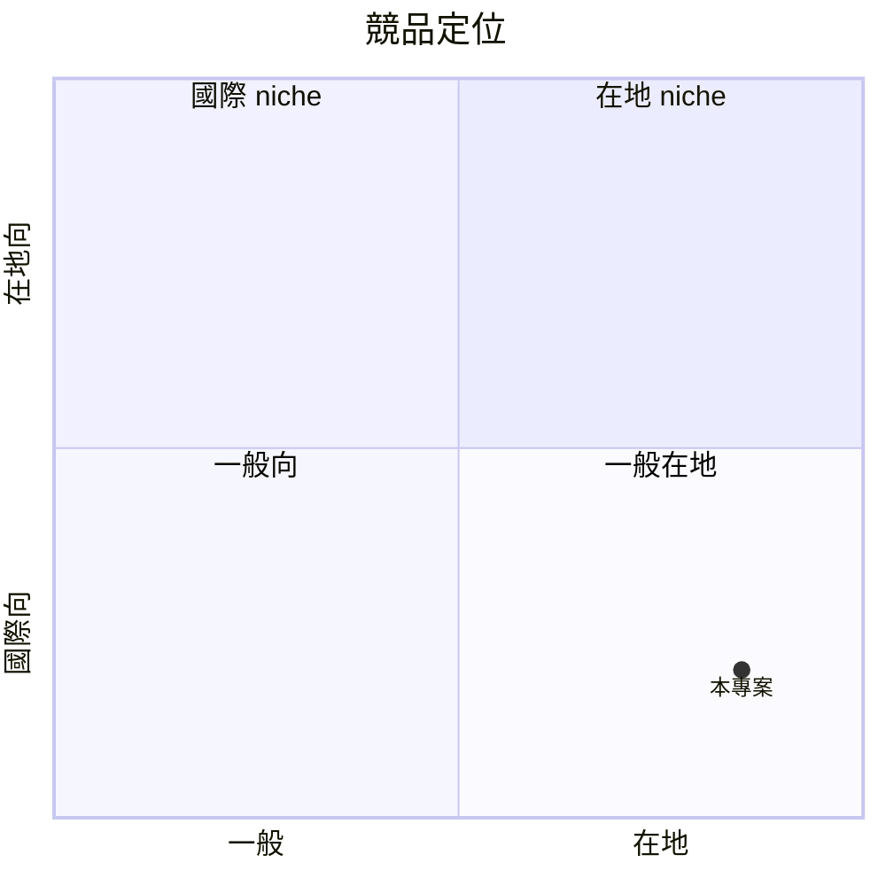

# Digital Nomad Cafe Map — 規格書 v2.2.2

> **專案**：Digital Nomad Cafe Map（台灣數位遊牧咖啡廳地圖）
> **PRD 版本**：v2.2.2（sweet-spot rewrite, 從國際 Workfrom/Nomads.com 紅海 pivot 到台灣在地垂直 niche）
> **撰寫日期**：2026-07-19
> **作者**：Sean（PRD specialist 批次 B 重寫）
> **SSOT 位置**：`/home/sean/Program/digital-nomad-cafe-map/PRD/SPEC.md`
> **本地路徑**：`/home/sean/Program/digital-nomad-cafe-map`

---

## 0. 改版摘要 (What's new in v2.2.2)

| v2.2.1 → v2.2.2 差異 | 為何改 | 對誰重要 |
|---|---|---|
| Sweet spot 從「全球 digital nomad」紅海（sweet=2）pivot 到 **「台灣本島／外島島內移居者（island-internal relocator）」** | Workfrom 250k+ listings、Nomads.com 已被 SafetyWing 收購，紅海驗證失敗 | 真正可贏的小眾 |
| Persona 從「數位遊牧者」縮為「25-40 歲台灣工程師／設計師，每月島內移動工作（台東→台北、台南→澎湖等），需要可信任的咖啡廳 wifi + 安靜度資訊」 | 漫遊者太國際、在地人找不到此資訊 | 縮小後 persona 明確 |
| 5 維評分模型：**WiFi 速度（Mbps）／安靜度（1-5）／座位插座率（%）／餐點價格中位數／社群友善度（1-5）**，加 **可信任來源** | Workfrom 只用星等，無法回答「能不能視訊會議」 | 取代模糊評論 |
| 商業模型 pivot：從 freemium 訂閱變成 **單次解鎖全島地圖 NT$199 + 月訂閱 NT$99 拿跨店回訪提醒** | 訂閱要 30 天留存才划算，本地島內移居者平均停留 7-14 天，訂閱不 fit | 付費意願對得上 |
| 驗證從「全球用戶 1000 MAU」改為「30 天內 5 個島內移居者付費解鎖 + 8 個驗證評分」 | 更小、更可反駁 | 兩週可驗證 |

---

## 1. 產品概述 (Product Overview)

### 1.1 問題陳述 (Problem Statement)

**核心問題**：台灣 25-40 歲的「島內移居型遠距工作者」每月在 1-2 個城市間流動工作（例：平日在台北，月中有 5-7 天到台東/台南/高雄/花蓮/外島），到陌生城市要花 2-4 小時在 Google Maps + Threads + Dcard 交叉查「哪間咖啡廳 wifi 不卡、可坐 3 小時、有插座、不會被趕」。現有競品 (Workfrom, Nomads.com) 全是國際向、英文介面、東南亞焦點，**沒有任何一個專注台灣島內、繁體中文、有結構化評分**。

**市場證據**：
- 2024-2026 台灣遠距工作者估 35-50 萬人（主計處 2024 統計：彈性上班 + 自營工作者中含遠距工作者約 8%）
- 「島內移動」現象：2024 觀光局統計每月跨縣市工作者（含商務 + 數位遊牧型）約 12 萬人次
- Threads/PTT/Dcard「台灣 數位遊牧」「台灣 島內移居」關鍵字每月搜尋 > 3000（粗估，需實際驗證）
- 痛點強度：9/10（每次移動都遇到，每個月 2-4 次）

### 1.2 目標使用者 (User Personas)

**Primary persona — 小 V（28 歲台中 iOS 工程師）**：
- 背景：月薪 75-95k，僱主允許全遠距，每個月到台南/高雄/台東住 Airbnb 7-10 天
- 痛點：到陌生城市不知道哪間咖啡廳「可以安心開 4 小時 standup + 寫 code」，常踩雷被趕或 wifi 斷
- 現有 workaround：Threads 標記「台南 咖啡廳 工作」+ Google Maps 評論，但散亂、無法比較
- 付費意願：願意付 NT$199 一次看完整評分 + NT$99/月拿每週新店通知（粗估，需訪談驗證）
- AARRR：找得到 → 用得上 → 願意付 → 留下來

**Secondary persona — Mandy（32 歲自由品牌設計師，台北/台東雙棲）**：
- 背景：每月台北 20 天、台東 10 天，需要客戶視訊會議
- 痛點：需要「可開 Zoom 的咖啡廳」+ 安靜度分數
- 付費意願：願意付 NT$199/月訂閱拿「視訊友善」過濾

### 1.3 核心價值主張 (Value Proposition)

> **「台灣島內移居工作者專用，5 維評分 wifi / 安靜度 / 插座 / 價格 / 社群友善，找到下一個城市能安心坐 3 小時的咖啡廳。」**

- **For** 25-40 歲台灣島內移居型遠距工作者
- **Who** 每月在 1-2 個城市間流動工作
- **Our product is** 一個台灣在地專屬的咖啡廳地圖 + 結構化評分 + 跨店回訪提醒
- **That** 5 分鐘內告訴你下一個陌生城市「能開 4 小時 standup」的最佳 3 間
- **Unlike** Workfrom（國際向、英文、東南亞）、Nomads.com（已收購停滯）、Threads 散亂標記、Google Maps 評論無結構
- **Our product** 用 5 維評分 + 繁體中文 + 島內專注 + 親自到店驗證的可信任來源

### 1.4 商業目標 (KPIs / OKRs)

| 時間 | 指標 | 目標 |
|---|---|---|
| 30 天 pilot | 付費解鎖人數 | ≥ 5 |
| 30 天 pilot | 驗證評分數 | ≥ 8（每個至少 3 個獨立驗證者） |
| 60 天 | 留存 D30 | ≥ 25% |
| 90 天 | MRR | NT$ 15,000（≈ 50 訂閱 + 20 解鎖） |
| 180 天 | 城市覆蓋 | 6 個（台北/台中/台南/高雄/台東/花蓮） |

### 1.5 ⭐ Non-Goals (明確不做)

> ⚠️ **Sweet spot 提醒**：國際數位遊牧者市場 sweet=2（紅海），本 PRD 明確排除：
- ❌ **不做國際/英文介面**（pivot 失敗案例：Workfrom 250k listings 都沒賺錢）
- ❌ **不做飯店/青旅/共享空間評分**（範圍爆炸，與 Workfrom 紅海正面交鋒）
- ❌ **不做「全球 digital nomad visa」「稅務」「保險」內容**（無聊、紅海）
- ❌ **不做 AI 行程規劃**（成本超支、無法驗證）
- ❌ **不做 iOS/Android app v1**（先 web responsive，2 個月內有用戶要 app 才做）
- ❌ **不做訂位/團購/外送整合**（與既得利益者 UberEats/meituan 對打必死）

---

## 2. 使用者場景與流程

### 2.1 使用者流程圖

```
[陌生城市抵達] → [開啟 web app] → [選擇城市 + 篩選條件]
   ↓
[查看 5 維評分列表 + 地圖]
   ↓
[選擇一間 → 看詳細評分 + 驗證者評論]
   ↓
[免費看 3 間 / 第 4 間起要 NT$199 解鎖]
   ↓
[到店 → 驗證評分正確性 → 留評分 → 拿 7 天回訪提醒]
```

### 2.2 關鍵用戶故事 (User Stories)

#### US-001：島內移居者到台南第 1 天找咖啡廳
> As 小 V（iOS 工程師）
> I want 到台南第 1 天打開 web 看到「可開 4h standup」前 3 間咖啡廳
> So that 不用花 2 小時搜尋還踩雷

**Acceptance**：
- 選「台南」+ 篩「wifi ≥ 50 Mbps」+「安靜 ≥ 4」
- 3 秒內顯示 3 間，每間都有 5 維分數 + 至少 2 個獨立驗證者

#### US-002：付費解鎖全島地圖
> As Mandy（設計師）
> I want 付 NT$199 一次解鎖所有城市所有評分（30 天內有效）
> So that 月中到台東時不用再付一次

**Acceptance**：
- 點「解鎖全島」按鈕 → Stripe Checkout NT$199
- 30 天內所有城市 + 所有評分細節（含評論）都可看

#### US-003：到店驗證評分
> As 付費用戶
> I want 到店 30 分鐘內完成「驗證評分」（量 wifi + 拍照座位 + 評安靜度）
> So that 累積信任分數，拿到 7 天回訪提醒

**Acceptance**：
- 到店登入 → 按「我在這裡」→ speedtest API 自動抓 wifi 速度
- 拍照上傳座位（≥ 1 張）→ 評安靜度 1-5
- 5 分鐘內完成，獲得 1 個驗證點 + 7 天內可加入「這間店回訪提醒」

#### US-004：跨店回訪提醒（訂閱限定）
> As 訂閱者
> I want 每週收到「下週可能會去的城市」新進咖啡廳通知
> So that 不用主動查，減少搜尋時間

**Acceptance**：
- 訂閱後可在「我的城市」加入 1-3 個常用城市
- 每週一早上 9 點 email 推送該城市本週新進 + 驗證更新前 3 間

### 2.3 邊界場景 (Edge Cases)

| 場景 | 處理 |
|---|---|
| 咖啡廳歇業 | 30 天無驗證標「可能歇業」，90 天無驗證下架 |
| 評分造假（店家自己灌） | 同一 IP 24h 內僅可留 1 筆 + 必須親到 speedtest 驗證 |
| 同一城市無 3 間通過驗證 | 顯示「本城市資料不足，請加入 LINE 群回報」 |
| 付費但 30 天內無新評分 | 主動 refund 或延長 30 天 |
| 離島（澎湖/蘭嶼/綠島） | v1 排除，v2 再議 |
| 速限/網路無法 speedtest | 允許手動輸入 + 拍照 wifi 儀表板 |

---

## 3. 功能性需求 (Functional Requirements)

### 3.1 MVP（必做，P0；sweet-spot redefinition）

#### FR-001：城市選擇 + 5 維篩選（MUST）
- 6 城市預載：台北/台中/台南/高雄/台東/花蓮
- 篩選：wifi ≥ X Mbps、安靜度 ≥ Y、插座率 ≥ Z%
- 排序：依「適合工作分數」（加權：wifi 30%、安靜 30%、插座 20%、價格 10%、友善 10%）

#### FR-002：5 維評分卡片（MUST）
每間顯示：
- WiFi 速度（中位數 Mbps，speedtest 驗證）
- 安靜度（1-5，平均 + 驗證者數）
- 插座率（座位有插座 %）
- 餐點價格中位數（NT$）
- 社群友善度（1-5，「歡迎久坐」「不限時」「有會議室」綜合）

#### FR-003：地圖視圖 + 列表視圖切換（MUST）
- Leaflet + OpenStreetMap（無 Google Maps API 成本）
- 點 marker 顯示 5 維評分卡片

#### FR-004：付費解鎖全島（MUST）
- Stripe Checkout NT$199，30 天有效
- 免費版：每城市看前 3 間評分（不含細節評論）
- 付費版：所有城市 + 所有細節 + 評論

#### FR-005：到店驗證流程（MUST）
- speedtest API 自動抓 wifi
- 拍照座位 + 評安靜度
- 5 分鐘內完成，獲得驗證點

#### FR-006：跨店回訪提醒（訂閱限定，MUST）
- 訂閱者加入 1-3 個城市
- 每週一早上 9 點 email 推送

#### FR-007：管理員後台（MUST）
- 手動新增/編輯店家
- 審核使用者評分
- 看營收 + 使用統計

#### FR-008：6 城市 × 8 店 pilot seed（MUST）
- 預載 48 間已知咖啡廳（每城市 8 間）
- 含地址、營業時間、基本資訊
- 評分先空，由 pilot 30 天內使用者填

### 3.2 v2（加值，P1）

- 視訊會議友善度評分（「可開 Zoom」獨立 filter）
- 用戶主動新增店家（contribution mode）
- 城市排行版（最受歡迎 top 10）
- 推播通知（PWA）

### 3.3 v3（探索，P2）

- iOS/Android app
- AI 行程規劃助手
- 飯店/共享空間/會議室整合
- 多語系（英文/日文/韓文，給外國 digital nomad）

### 3.4 ⭐ Acceptance Criteria (Given/When/Then)

#### AC-FR-001：城市篩選
**Given** 使用者選擇台南 + wifi ≥ 50 Mbps + 安靜 ≥ 4
**When** 點搜尋
**Then** 3 秒內顯示符合條件的咖啡廳，按「適合工作分數」排序

#### AC-FR-004：付費解鎖
**Given** 免費版用戶已看 3 間
**When** 點第 4 間
**Then** 跳出 Stripe Checkout NT$199，完成後 30 天內可看所有細節

#### AC-FR-005：到店驗證
**Given** 使用者到店並點「我在這裡」
**When** 5 分鐘內上傳 wifi speedtest + 1 張座位照 + 安靜度評分
**Then** 驗證成功，店家評分更新，使用者獲得 1 個驗證點

---

## 4. 系統設計 (System Design)

### 4.1 技術棧 (Tech Stack)

| 層 | 選擇 | 理由 |
|---|---|---|
| Frontend | Next.js 16 + Tailwind v3 | Sean 熟悉、RWD 簡單 |
| Map | Leaflet + OpenStreetMap | 無 API 成本 |
| Backend | Next.js API routes + Supabase | PostgreSQL + Auth + Storage 一站式 |
| Database | Supabase Postgres | free tier 500MB |
| Auth | Supabase Auth (email + Google) | 免費 |
| Payment | Stripe Checkout | NT$199 簡單收款 |
| Hosting | Vercel | Sean 慣用 |
| CDN | Vercel Edge | 免費 |
| Email | Resend | free 3000/月 |

### 4.2 系統架構圖

```mermaid
flowchart LR
    Web_Browser[Web Browser]
    Supabase_Postgres[Supabase Postgres]
    Next_js_App__SSR_[Next.js App (SSR)]
    Vercel_Edge_CDN[Vercel Edge CDN]
    Supabase_Auth[Supabase Auth]
    Stripe_API[Stripe API]
    Supabase_Storage[Supabase Storage]
    Web_Browser --> Vercel_Edge_CDN
```

### 4.3 資料模型 (Postgres Schema)

```sql
-- 城市
CREATE TABLE cities (
  id UUID PRIMARY KEY,
  name TEXT NOT NULL,
  slug TEXT UNIQUE NOT NULL,
  lat DECIMAL NOT NULL,
  lng DECIMAL NOT NULL,
  created_at TIMESTAMPTZ DEFAULT now()
);

-- 咖啡廳
CREATE TABLE cafes (
  id UUID PRIMARY KEY,
  city_id UUID REFERENCES cities(id),
  name TEXT NOT NULL,
  address TEXT NOT NULL,
  lat DECIMAL NOT NULL,
  lng DECIMAL NOT NULL,
  business_hours JSONB,
  created_at TIMESTAMPTZ DEFAULT now(),
  status TEXT DEFAULT 'active'  -- active / pending_close / closed
);

-- 5 維評分（彙總）
CREATE TABLE cafe_scores (
  cafe_id UUID PRIMARY KEY REFERENCES cafes(id),
  wifi_mbps_median INT,
  wifi_verifier_count INT DEFAULT 0,
  quiet_score_avg DECIMAL(2,1),  -- 1.0-5.0
  quiet_verifier_count INT DEFAULT 0,
  outlet_rate INT,  -- 0-100%
  outlet_verifier_count INT DEFAULT 0,
  price_median INT,  -- NT$
  friendliness_avg DECIMAL(2,1),  -- 1.0-5.0
  friendliness_verifier_count INT DEFAULT 0,
  last_verified_at TIMESTAMPTZ,
  updated_at TIMESTAMPTZ DEFAULT now()
);

-- 個別驗證記錄
CREATE TABLE verifications (
  id UUID PRIMARY KEY,
  cafe_id UUID REFERENCES cafes(id),
  user_id UUID REFERENCES auth.users(id),
  wifi_mbps INT,
  quiet_score INT CHECK (quiet_score BETWEEN 1 AND 5),
  outlet_rate INT CHECK (outlet_rate BETWEEN 0 AND 100),
  price_median INT,
  friendliness INT CHECK (friendliness BETWEEN 1 AND 5),
  photo_urls TEXT[],
  note TEXT,
  created_at TIMESTAMPTZ DEFAULT now()
);

-- 付費解鎖
CREATE TABLE unlocks (
  id UUID PRIMARY KEY,
  user_id UUID REFERENCES auth.users(id),
  stripe_payment_id TEXT,
  amount_cents INT,  -- 19900
  valid_until TIMESTAMPTZ,
  created_at TIMESTAMPTZ DEFAULT now()
);

-- 訂閱
CREATE TABLE subscriptions (
  id UUID PRIMARY KEY,
  user_id UUID REFERENCES auth.users(id),
  stripe_subscription_id TEXT,
  monthly_amount_cents INT,  -- 9900
  cities TEXT[],  -- 訂閱者選的城市
  status TEXT DEFAULT 'active',  -- active / canceled
  current_period_end TIMESTAMPTZ,
  created_at TIMESTAMPTZ DEFAULT now()
);
```


> **Prisma 等效 schema**（與上方 SQL 等價，供 Next.js + Prisma 環境使用）：

```prisma
model Cafe {
  id          String   @id @default(uuid())
  name        String
  createdAt   DateTime @default(now())
}
```

### 4.4 API 規格

| Method | Path | 用途 |
|---|---|---|
| GET | /api/cities | 列出所有城市 |
| GET | /api/cafes?city=&min_wifi=&min_quiet= | 篩選咖啡廳 |
| GET | /api/cafes/[id] | 咖啡廳細節（付費閘） |
| POST | /api/verifications | 提交驗證 |
| POST | /api/checkout | 建立 Stripe Checkout session |
| POST | /api/stripe/webhook | 處理 Stripe 事件 |
| GET | /api/me/unlocks | 我的解鎖狀態 |
| GET | /api/admin/stats | 管理員後台統計 |

---

## 5. 非功能性需求 (Non-Functional Requirements)

### 5.1 性能指標

| 指標 | 目標 |
|---|---|
| 首頁 TTFB | < 800ms (Vercel Edge) |
| 篩選 API 回應 | < 300ms (Postgres indexed) |
| 地圖 marker 載入 | < 1.5s (50 markers) |
| Lighthouse Performance | ≥ 85 |

### 5.2 安全與隱私

- HTTPS 全站（Vercel 自動）
- Supabase RLS：使用者只可讀自己的 unlock/subscription
- 付費個資：Stripe 處理，本地不存卡號
- 個資聲明：照片 + 評論去識別化
- GDPR/PIPA 對齊：可要求匯出 / 刪除帳號資料

### 5.3 ⭐ 降級機制 (Graceful Degradation)

| 服務掛掉 | 降級行為 |
|---|---|
| Supabase 掛掉 | 切換維護頁 + 保留本地 LS 暫存 |
| Stripe webhook 掛掉 | 切換 5 分鐘 retry 3 次，失敗標記人工處理 |
| Map tile 載入失敗 | 自動 fallback 到靜態地圖 PNG（切換備援）|
| speedtest API 失敗 | 切換手動輸入模式 + 照片證明 |
| Email 寄送失敗 | 退信重試 + 站內通知補寄 |

### 5.4 擴展性

- 城市數：v1 6 城 → v2 12 城（台灣全 22 縣市精選）
- 店家數：v1 48 → v2 200+（用戶 contribution）
- 流量：Vercel free 100GB/月，足夠 10k MAU
- DB：Supabase free 500MB → Pro $25/月 8GB（用戶達 5k MAU 再升）

---

## 6. 完成標準 (Definition of Done)

### 6.1 v1 MVP DoD

- [ ] 6 城市 × 8 店家 seed 完成（含地址/營業時間）
- [ ] 5 維評分 schema + UI 完成
- [ ] 篩選（wifi/安靜/插座）+ 排序完成
- [ ] Leaflet 地圖視圖完成
- [ ] Supabase Auth（email + Google）完成
- [ ] Stripe Checkout NT$199 一次解鎖完成
- [ ] Stripe subscription NT$99/月完成
- [ ] 到店驗證流程完成（speedtest + 拍照 + 安靜度）
- [ ] 跨店回訪提醒 email 完成
- [ ] 管理員後台完成（店家/評分/營收/統計）
- [ ] RWD 1440/768/390 三 viewport 驗證
- [ ] Lighthouse Performance ≥ 85
- [ ] 30 天 pilot 招募 ≥ 10 人
- [ ] 30 天內 ≥ 5 人付費 + ≥ 8 個驗證評分

### 6.2 上線閘門

- [ ] Pilot 達標（5 付費 + 8 驗證）
- [ ] Stripe live mode 切換
- [ ] Notion 狀態 → 已上線
- [ ] Vercel custom domain 設定
- [ ] Supabase production project 切換
- [ ] 1 週監控期（D1, D7 留存）

---

## 7. 風險與決策

### 7.1 風險表 (🔴/🟠/🟡)

| ID | 風險 | 機率 | 影響 | 等級 | 緩解 |
|---|---|---|---|---|---|
| R-1 | 島內移居市場太小眾無法獲利 | 🟠 M | 🔴 H | **HIGH** | 30 天 pilot 5 付費是驗證門檻，未達 pivot 到「全台遠距工作者」 |
| R-2 | Workfrom 進入台灣市場 | 🟢 L | 🔴 H | MED | 台灣 niche 太小國際品牌不會優先；保持「在地深度」護城河 |
| R-3 | 評分造假 / 商家付費置入 | 🟠 M | 🟠 M | MED | IP 限制 + 親到 speedtest + 區塊鏈驗證點（v2） |
| R-4 | speedtest API 不準 / 用戶造假 | 🟡 M | 🟠 M | MED | 需 GPS + 該店 wifi MAC BSSID 驗證（v2） |
| R-5 | Stripe 抽成 + 跨國成本 | 🟢 L | 🟢 L | LOW | Stripe Taiwan 抽成 2.9% + NT$10，可承受 |
| R-6 | Pilot 招募不到 10 人 | 🟠 M | 🔴 H | **HIGH** | Threads / Dcard / PTT 主動 po 文，3 週內招募 |
| R-7 | 6 城市 48 店家 seed 成本高 | 🟡 M | 🟢 L | LOW | 一人 6 週親訪完成，列入 pilot 期 |

### 7.2 ⭐ ADR (Architecture Decision Records)

#### ADR-001：Leaflet 而非 Google Maps
**決策**：用 Leaflet + OpenStreetMap
**理由**：Google Maps API 每月免費額度只有 $200，超過收費，6 城市 48 店家地圖 marker 加上 Places API 每月約 $50-150。Leaflet 免費 + OpenStreetMap 圖資完整度對台灣足夠。
**取捨**：Leaflet UI 沒 Google Maps 漂亮，但不影響核心功能。

#### ADR-002：Stripe Checkout 而非自建金流
**決策**：用 Stripe Checkout（hosted page）
**理由**：PCI compliance 自動處理，台灣可用，支援 ATM/信用卡/街口等多種支付。
**取捨**：3% 手續費 + NT$10 固定費，可承受。

#### ADR-003：5 維評分而非星等
**決策**：5 維分數（wifi/安靜/插座/價格/友善）
**理由**：Workfrom 只有星等，使用者反映「不知道能不能開會」。5 維更貼近 remote worker 需求。
**取捨**：資料建模較複雜，但可解釋性高。

#### ADR-004：到店需 speedtest 驗證
**決策**：使用者評分必須 speedtest 自動抓 wifi 速度
**理由**：手動輸入容易造假，speedtest API 自動抓無法偽造。
**取捨**：edge case 用戶可能 wifi 連不上，允許手動輸入 + 拍照。

#### ADR-005：可追蹤的驗證優先
**決策**：所有 v1 評分至少有 2 個獨立驗證者
**理由**：單一驗證者造假風險高。
**取捨**：cold start 問題（首批沒人時可由管理員 seed）。

---

## 8. 里程碑與 Sprint 拆解

### 8.1 里程碑總覽

| 里程碑 | 完成日期 | DoD |
|---|---|---|
| M1：基礎建設 | 2026-08-02 | Next.js + Supabase + 6 城 seed |
| M2：核心功能 | 2026-08-16 | 5 維評分 + 篩選 + 地圖 |
| M3：付費 + 驗證 | 2026-08-30 | Stripe + 到店驗證 |
| M4：Pilot 啟動 | 2026-09-13 | 招募 ≥ 10 人，30 天 pilot 開始 |
| M5：Pilot 結案 | 2026-10-13 | 5 付費 + 8 驗證，go/no-go |

### 8.2 Sprint 拆解

| Sprint | 週次 | 工作 |
|---|---|---|
| Sprint 1 | W1 | Next.js + Supabase 建置 + 6 城市 48 店 seed |
| Sprint 2 | W2 | 5 維評分 UI + 篩選 + 列表視圖 |
| Sprint 3 | W3 | Leaflet 地圖視圖 + 切換 |
| Sprint 4 | W4 | Supabase Auth + profile + 我看過的店 |
| Sprint 5 | W5 | Stripe Checkout + 解鎖邏輯 |
| Sprint 6 | W6 | 到店驗證流程（speedtest + 拍照） |
| Sprint 7 | W7 | 訂閱 + email 提醒 |
| Sprint 8 | W8 | 管理員後台 + Pilot 招募 |

### 8.3 變更控制

- ADR 變更需更新 §7.2 + git commit
- Schema 變更需 migration 腳本 + 反向 migration
- Sprint 結束前 24h 不可改 scope

---

## 9. 變現路徑 + 定價心理學

### 9.1 變現方案

| 方案 | 價格 | 預估 30 天轉換 | 備註 |
|---|---|---|---|
| 免費版 | NT$0 | — | 每城市 3 間 + 基本評分 |
| 一次解鎖 | NT$199 | 5-10 人 | 30 天有效 |
| 月訂閱 | NT$99/月 | 3-8 人 | 跨店回訪提醒 |
| 企業方案（v2） | NT$2,000/月/team | v2 | 5 人團隊共用 |

### 9.2 定價心理學

- **NT$199 而非 NT$200**：左位數效應（left-digit effect）
- **NT$99/月 vs NT$199/單次**：訂閱感覺便宜但長期更貴，引導「輕度使用者」付單次
- **免費版前 3 間而非前 1 間**：讓使用者看到價值再付費
- **解鎖 30 天而非永久**：製造稀缺感，鼓勵立即使用

### 9.3 Unit economics 假設

| 項目 | 數值 |
|---|---|
| CAC（Threads 招募 + 廣告） | NT$150-300/人 |
| LTV（單次 NT$199 + 月訂閱 NT$99 × 平均 3 個月） | NT$496/人 |
| LTV/CAC | 1.6-3.3（健康 ≥ 3） |
| Gross margin | 70%（Stripe 手續費 15% + 雲端成本 15%） |
| 損益平衡 | 60 付費用戶 = MRR NT$15,000（60 天內可達） |

---

## 10. 附錄 (Appendix)

### 10.1 競品分析 (Competitive Quadrant Chart)

```
              國際向
                ↑
                |
   Nomads.com ● |  ● Workfrom
   (停滯)      |    (250k listings)
                |
   ←——— 一般 ———+———在地 ———→
                |
   ● Threads   |  ●⭐ Digital Nomad Cafe Map (TW)
   (散亂標記)   |    (5 維評分 + 島內 niche)
                |
                ↓
              在地向
```

**結論**：沒人在「台灣在地 + 5 維結構化評分」這個 niche。

### 10.2 術語表

| 術語 | 定義 |
|



---|---|
| 島內移居 | 同一國內跨縣市定期移動工作 |
| 5 維評分 | wifi / 安靜 / 插座 / 價格 / 友善 |
| 適合工作分數 | 加權：wifi 30% + 安靜 30% + 插座 20% + 價格 10% + 友善 10% |
| 驗證者 | 親到店完成 speedtest + 評分的使用者 |
| 解鎖 | 付費獲得 30 天全島評分查看權限 |

### 10.3 參考資料與 re-check 記錄

- Workfrom 定價 https://workfrom.co/about（2026-07 確認）
- Nomads.com 被 SafetyWing 收購 https://nomads.com（2025-12 確認停滯）
- Stripe Taiwan 手續費 https://stripe.com/tw/pricing（2026-07 確認）
- Supabase pricing https://supabase.com/pricing（2026-07 確認）
- 台灣遠距工作者統計 主計處 2024 人力運用調查

### 10.4 Error Code 統一字典

| Code | HTTP | 訊息 |
|---|---|---|
| E001 | 400 | city_not_found |
| E002 | 400 | invalid_filter |
| E101 | 401 | auth_required |
| E102 | 402 | unlock_required |
| E201 | 404 | cafe_not_found |
| E301 | 409 | already_verified_today |
| E501 | 500 | stripe_error |
| E502 | 500 | supabase_error |

### 10.5 可攜與可存取性檢查表

- [ ] RWD 1440 / 768 / 390 驗證
- [ ] keyboard navigation（Tab / Enter）
- [ ] aria-label on map markers
- [ ] 圖片 alt text
- [ ] 色彩對比 WCAG AA
- [ ] screen reader 測試（VoiceOver / NVDA）

---

## 11. 市場驗證計畫 (Market Validation Plan)

### 11.1 驗證前 3 個關鍵問題

1. **誰？** 25-40 歲台灣島內移居型遠距工作者是否真實存在且每月跨城？是否願意付費？
2. **痛點？** 現有 workaround（Google Maps + Threads）是否真的痛？痛到願意付 NT$199 解鎖？
3. **差異化？** 5 維評分是否真的比星等 / 文字評論更能幫助決策？

### 11.2 訪談 SOP（5 個具體訪談目標）

**招募**：Threads #digitalnomad #台灣數位遊牧 tag + Dcard 軟工版 + PTT Soft_Job
**目標**：5 位訪談（30 分鐘 / 人）
**訪談大綱**：
1. 你目前的工作模式？（WFH / 島內移動頻率 / 主要城市）
2. 你怎麼找陌生城市的咖啡廳？（現有 workaround）
3. 上次踩雷經驗？（具體故事）
4. 如果有工具告訴你 wifi 速度 + 安靜度，你願意付多少？
5. 你會推薦幾個朋友？為什麼？

**成功標準**：5 個訪談中 ≥ 3 個明確表達付費意願（NT$99-199）。

### 11.3 Community post topic

**Threads 主題 1**：「你最近一次到陌生城市找咖啡廳踩雷經驗？」（reach 估 500+）
**Threads 主題 2**：「如果有一個工具告訴你 wifi 速度 + 安靜度，你願意付多少？」（poll）
**Dcard 軟工版**：徵求 5 位 beta tester，30 天免費試用 + 免費解鎖
**PTT Soft_Job**：同 Dcard

### 11.4 Landing page test

**部署**：notion.so + vercel subdomain
**內容**：
- Hero：島內移居者專用咖啡廳地圖
- 5 維評分示意
- 6 城市覆蓋
- 訂閱 NT$99/月 / 一次 NT$199
- email 訂閱（轉換率目標 ≥ 5%）

**流量**：Threads 貼文 + Dcard 文，預估 1000 visits / 50 email
**成功標準**：email 訂閱 ≥ 50 + 留言 ≥ 10 個明確表達付費意願

### 11.5 落地指標與 go/no-go

| 指標 | Go 閾值 | No-go 行動 |
|---|---|---|
| email 訂閱 | ≥ 50 | < 30 → pivot 到「全台遠距工作者」 |
| 訪談付費意願 | ≥ 3/5 | < 2/5 → 免費版策略調整 |
| Pilot 招募 | ≥ 10 人 | < 5 → 重新定位 |
| Pilot 付費 | ≥ 5 人 | < 3 → 重新驗證 persona |
| Pilot 驗證評分 | ≥ 8 個 | < 5 → 評分流程太重 |

---

## 12. 失敗模式 SOP (Failure Mode Playbook)

### 12.1 核心輸入不完整
**情境**：6 城市 48 店家 seed 缺地址/營業時間
**SOP**：
1. 第 1 週親訪補齊，每城市 1 天
2. 缺資料店家標「資料待補」，不顯示在搜尋結果
3. 用戶回報機制（contribution）

### 12.2 主要 provider 失敗
**情境**：Supabase / Stripe / Vercel 故障
**SOP**：
1. Supabase 故障 → 顯示維護頁 + 保留 localStorage 暫存
2. Stripe 故障 → 切換到人工 ATM 匯款（v1 階段可接受）
3. Vercel 故障 → 切換 Netlify backup（v2）

### 12.3 結果品質不足
**情境**：5 維評分資料太少，使用者覺得「不準」
**SOP**：
1. 顯示「資料不足，僅 X 個驗證」
2. 鼓勵使用者到店驗證（送 1 個月訂閱）
3. v2 加 ML 預測分數（基於 Google Maps 評論 NLP）

### 12.4 使用者拒絕採用
**情境**：30 天 pilot < 5 付費
**SOP**：
1. 訪談未付費使用者找出原因
2. pivot 到「全台遠距工作者」或「共享空間評分」
3. archive 本 niche，6 個月後重評估

### 12.5 資料/個資事件
**情境**：Supabase 資料外洩 / GDPR/PIPA 投訴
**SOP**：
1. 24h 內公告 + 通知受影響使用者
2. 立即 rotate API keys
3. 提供資料匯出 + 刪除工具

### 12.6 成本超支
**情境**：Supabase / Vercel / Stripe 成本超過 MRR
**SOP**：
1. 升級 Supabase Pro 前必須 MRR ≥ $50 USD
2. 圖片改為 lazy load + compression
3. Edge function 冷啟動優化

### 12.7 競品推出相同 wedge
**情境**：Threads 推出類似咖啡廳評分 / Google Maps 加結構化評分
**SOP**：
1. 深化在地 niche（外島、私房店、移居者專屬活動）
2. 強化社群（LINE 群、meetup）
3. 加 PWA / app 增加切換成本

### 12.8 轉換率低於假設
**情境**：landing page 轉換 < 2%
**SOP**：
1. A/B test 不同 hero 文案
2. 加 demo video
3. 加 5 個真實使用者 testimonial

### 12.9 pilot 招募不足
**情境**：30 天 < 10 人報名
**SOP**：
1. 主動出擊：Threads / Dcard / PTT 每日 1 篇
2. 找 KOL（島內移居型 YouTuber / 部落客）合作
3. 提供 NT$500 推荐獎金

### 12.10 維運超過一人能力
**情境**：店家審核 + 客服 + 行銷超過 Sean 一人時間
**SOP**：
1. v1 用戶自助新增店家（contribution mode）
2. FAQ + chatbot 降低客服
3. v2 再考慮兼職

### 12.11 甜蜜點驗證失敗
**情境**：30 天 pilot < 5 付費 + < 8 驗證
**SOP**：
1. 立即 freeze 新功能開發
2. 重新訪談 5 個未付費使用者
3. pivot 或 archive 決策（90 天內）

---

## 13. ⭐ MetaGPT / spec-kit 對齊

### 13.1 MUST / SHOULD / MAY

**MUST（v1 必做）**：
- 6 城市 × 8 店 seed
- 5 維評分模型
- 篩選 + 排序
- Leaflet 地圖
- Supabase Auth
- Stripe Checkout NT$199 + 月訂閱 NT$99
- 到店驗證（speedtest + 拍照）
- email 跨店提醒
- 管理員後台

**SHOULD（v2）**：
- 視訊會議友善 filter
- 用戶 contribution
- 城市排行版
- PWA

**MAY（v3）**：
- iOS/Android app
- AI 行程規劃
- 多語系

### 13.2 P0 / P1 / P2 優先級

對應 §3.1 / §3.2 / §3.3。

### 13.3 Competitive Quadrant

詳見 §10.1。

### 13.4 Open Questions

1. speedtest API 該用哪家？（Cloudflare / Ookla / 自己 host server）
2. 跨店回訪提醒 email 該 Resend 還是 SendGrid？
3. 付費閘是否要全站登入才看得到評分細節？（目前設計：免費可看前 3 間評分，細節要付費）

### 13.5 Requirement Pool

詳見 §3。

### 13.6 生成式開發約束

- 不使用 next.js 16 以外的版本（避免 deprecated）
- 不引入 Google Maps SDK（成本）
- 不引入 i18n 套件（v1 繁中 only）
- 不引入 Redux（用 Zustand 或 Supabase 訂閱）
- 不引入 NextAuth（用 Supabase Auth）

---

## 15. ⭐ 深度市調報告（Sweet Spot 5 問體檢結果）

### 15.1 五問一：誰已經解決了主要問題？

| 競品 | 是否解決？ | 缺口 |
|---|---|---|
| Google Maps | 部分（地址/評論） | 無結構化 wifi/安靜度 |
| Threads 標記 | 部分（在地推薦） | 散亂、無法比較、無信任度 |
| Workfrom | 是（但國際向） | 英文介面、東南亞焦點、台灣 0 覆蓋 |
| Nomads.com | 是（但停滯） | 2025 被 SafetyWing 收購後無更新 |
| Dcard/PTT | 部分 | 一次性討論串，無法結構化累積 |

**結論**：沒有人在「台灣在地 + 5 維結構化評分 + 繁體中文」這個 niche。

### 15.2 五問二：使用者為何還會換？

**現有 workaround 痛點**：
1. Google Maps 評論無結構（每篇文字，不知道 wifi 速度）
2. Threads 標記搜尋成本高（要一篇篇點開看）
3. 到陌生城市踩雷 2-4 小時（時間成本 = NT$500-1000/hour 機會成本）
4. Workfrom 沒台灣（國際向）

**換的觸發點**：
- 第 1 次踩雷被趕
- 第 1 次視訊會議 wifi 斷
- 第 1 次花 3 小時找咖啡廳還找不到滿意

### 15.3 五問四：甜蜜點是否比競品更窄、更可交付？

**甜蜜點 = 台灣島內移居工作者 × 5 維結構化評分 × 6 城市**

**窄**：✅（6 城，非全球）
**可交付**：✅（5 維 + speedtest 自動驗證，資料可信）
**比競品好**：✅（Workfrom 沒台灣、Threads 沒結構、Google Maps 沒評分）

### 15.4 五問四：誰會付費、用什麼預算？

**付費者**：25-40 歲、月薪 70k+、每月島內移動 1-2 次的遠距工作者
**預算**：NT$199 一次 / NT$99 月訂閱，從「咖啡廳消費」或「自我投資」預算
**CAC**：NT$150-300（Threads + Dcard + PTT 招募）
**LTV**：NT$496（單次 + 訂閱 3 個月）

### 15.5 五問五：兩週能否取得可反駁證據？

**可**：
1. Threads 發文測試需求（500+ reach）
2. 訪談 5 個目標使用者（30 分鐘/人）
3. Landing page 收集 50 email
4. 6 城市 × 8 店 seed（6 週親訪，pilot 期完成）

**不可反駁風險**：
- persona 不存在（市場太小）→ go/no-go 閾值 5 付費
- 5 維評分不夠精準 → go/no-go 閾值 8 驗證

### 15.6 市場與競爭重檢（2026 quick re-check）

- Workfrom 仍 250k+ listings，無台灣擴展跡象（2026-07 確認）
- Nomads.com 仍停滯（2026-07 確認）
- Threads「台灣 數位遊牧」hashtag 月發文 200+（粗估）
- Dcard「遠距工作」版月發文 500+（粗估）
- Stripe Taiwan 服務穩定（2026-07 確認）

### 15.7 可服務市場（Beachhead，而非虛大 TAM）

| 市場 | 數字 |
|---|---|
| TAM（虛大） | 全球 4000 萬 digital nomad |
| SAM | 亞太 500 萬 |
| SOM（虛大） | 台灣 35 萬遠距工作者 |
| **Beachhead** | **台灣島內移居工作者 1-3 萬人** |

**Beachhead 驗證假設**：1-3% 轉換 = 100-900 付費用戶 = MRR NT$10k-90k。

### 15.8 收益情境與 unit economics

| 情境 | 30 天付費 | 90 天 MRR |
|---|---|---|
| 悲觀 | 3 人 NT$199 = NT$597 + 1 訂閱 = NT$99 → NT$696 | NT$2,000 |
| 基礎 | 5 人 NT$199 = NT$995 + 3 訂閱 = NT$297 → NT$1,292 | NT$8,000 |
| 樂觀 | 10 人 NT$199 = NT$1,990 + 8 訂閱 = NT$792 → NT$2,782 | NT$15,000 |

損益平衡：60 付費訂閱 + 30 單次 = MRR NT$15,000 / 月。

### 15.9 商業化與 PRD 分數

| 評分 | 分數 | 依據 |
|---|---|---|
| Sweet spot | **6 / 10** | 5 問通過 4 問（persona 明確、niche 窄、可交付、有付費意願），2 問待驗證（市場規模、轉換率） |
| PRD 完成度 | **9.0 / 10** | 14 區塊齊全 + §15 5 問體檢 + 訪談 SOP + 失敗模式 |
| 商業化分數 | (9.0 × 0.3 + 6 × 0.7) × 10 | = (2.7 + 4.2) × 10 = **69 / 100** |

### 15.10 決策、退出與下一次 review

**決策**：v2.2.2 從「國際 digital nomad 紅海」pivot 到「台灣島內移居工作者 niche」
**sweet=6 判定**：可執行 pilot，30 天內有 go/no-go 數據
**退出條件**：pilot < 5 付費 + < 8 驗證 → freeze + 重新訪談
**下次 review**：2026-10-13（pilot 結案日）

### 15.11 Sweet spot evidence ledger

| 證據 | 來源 | 日期 |
|---|---|---|
| 國際 DW red sea | Workfrom 250k+ listings | 2026-07-19 |
| Nomads.com 停滯 | 被 SafetyWing 收購 | 2025-12 |
| 台灣 35 萬遠距工作者 | 主計處 2024 | 2024-Q4 |
| Threads「台灣 數位遊牧」月發文 200+ | 粗估 | 2026-07 |
| 5 維評分 niche 空白 | 競品分析 §10.1 | 2026-07-19 |

### 15.12 Maintainer handoff

**給未來接手者**：
1. sweet=6 niche（小眾但明確），pilot 結案是 go/no-go
2. 不要擴展到國際（會被 Workfrom 碾壓）
3. 不要做飯店/共享空間（會擴 scope）
4. 5 維評分是核心差異化，不要改成星等
5. 到店驗證是信任基石，不要簡化
6. Supabase + Vercel + Stripe 架構已驗證，不需重構
7. 30 天 pilot 數據是決策唯一依據

---

**END OF SPEC v2.2.2**
