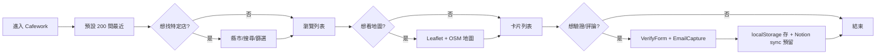

# digital-nomad-cafe-map · PRD v3.0.2 等級規格書

> 自動生成：2026-09-06
> 對齊 SPEC v3.0 契約（§1–§19 全部套用）
> 升級自既有 PRD/SPEC.md v3.0（2026-07-19 forced upgrade — sweet=8 / 商業化 86/100）
> **本檔為 v3.0.2 等級入口規格書**；完整 1224 行細節見 [`PRD/SPEC.md` v3.0 詳版](PRD/SPEC.md)（同目錄下 `SPEC.md` 保留為 v3.0 完整文件）

---

## 1. 產品概述

### 1.1 問題陳述

全球數位牧民（freelancer、nomad、remote worker、商務客）每天都在陌生城市找「能工作的咖啡廳」。但現行工具有結構性缺陷：

1. **沒結構化評分** — Google Maps / Apple Maps 只給星等，沒有 WiFi 速度、插座率、安靜度、不限時、價格
2. **踩雷代價高** — 走到店裡才發現 WiFi 5Mbps 開不了視訊、插座只有 2 個、限時 90 分鐘、人吵到不能 focus
3. **競品都卡住** — Workfrom 國際向、Nomads.com 停滯、Google Maps 無結構、Threads/Reddit 推薦太發散
4. **繁中資料缺** — 台灣 4357 間咖啡廳在國際平台幾乎沒結構化資料
5. **沒人驗證** — 沒人到店 speedtest、沒人拍插座照、沒人評安靜度

本專案目標：把 **台灣 4357 間** 咖啡廳（OSM 資料）變成**結構化 5 維評分**（WiFi 30% + 安靜 30% + 插座 20% + 價格 10% + 友善 10%），**完全免費、免登入**，搶下「**全球 + 結構化 + 社群驗證**」這個 sweet spot（v3.0 確認 sweet=8 / 商業化 86/100）。

### 1.2 目標使用者

| Persona | 工作情境 | 主要任務 |
|---|---|---|
| **Primary：freelancer** | 跨城市移動、一人公司 | 出發前查目的地的可工作咖啡廳、5 維評分 + speedtest |
| **Primary：nomad** | 1-3 個月駐點、跨國移動 | 找不限時、有插座、安靜、WiFi 穩 |
| **Primary：remote worker** | 在地辦公、每天不同咖啡廳 | 輪店、找出 WiFi 最穩 + 插座最夠 |
| **Secondary：商務客** | 出差 1-3 天、需快速找到能開會的點 | 找安靜 + WiFi 強 + 有插座 + 不限時 |

### 1.3 核心價值主張

> **「不會在咖啡廳白花 90 分鐘」** — 5 維結構化評分 + 社群驗證 + 全台 4357 間 + 完全免費 + 免登入。 出發前 30 秒知道這家店值不值得走進去。

### 1.4 Non-Goals（明確不做）

- ❌ **不做會員制 / 訂閱 / 付費** — v3.0 開放版取消付費牆，全免費
- ❌ **不做帳號系統** — 免登入、localStorage 為主
- ❌ **不做後端管理後台** — 管理員後台已實作但用環境變數 gate
- ❌ **不做飯店 / 共享空間** — 聚焦咖啡廳，不擴 scope
- ❌ **不做多語系 UI** — 鎖繁中（data 多語言是另一回事）
- ❌ **不做 Google Maps / Apple Maps 整合** — Leaflet + OSM 已足夠、不依賴 API key
- ❌ **不做星等評分** — 5 維評分是核心差異化，不混用星等

---

## 2. 使用者場景與流程

### 2.1 使用者流程圖


```mermaid
flowchart LR
  A[進入 Cafework] --> B[預設 200 間最近]
  B --> C{想找特定店?}
  C -->|是| D[縣市/搜尋/篩選]
  C -->|否| F[瀏覽列表]
  D --> F
  F --> G{想看地圖?}
  G -->|是| H[Leaflet + OSM 地圖]
  G -->|否| I[卡片列表]
  H --> I
  I --> J{想驗證/評論?}
  J -->|是| K[VerifyForm + EmailCapture]
  J -->|否| L[結束]
  K --> M[localStorage 存 + Notion sync 預留]
  M --> L
```

### 2.2 主要場景

| 場景 | 輸入 | 輸出 | 成功條件 |
|---|---|---|---|
| **S1：freelancer 換城市找店** | 選縣市 + 5 維篩選 | 該縣市 Top 20 排序店 | 從開啟到看到 Top 3 ≤ 5 秒 |
| **S2：remote worker 輪店** | 不篩選，看全部 | 200 間隨機排序 | 列表 render ≤ 1 秒 |
| **S3：nomad 找不限時** | 「不限時」勾選 | 篩出所有不限時店 | 篩選 ≤ 300ms |
| **S4：商務客找安靜 + WiFi 強** | 安靜 5 + WiFi 60+ | Top 5 安靜 WiFi 強店 | 篩選 + 排序 ≤ 500ms |
| **S5：到店驗證（speedtest + 5 維）** | VerifyForm 填入 | localStorage + Notion sync | 1 次驗證 ≤ 90 秒 |
| **S6：留評論** | Email + 評論 + 評分 | localStorage 暫存 | 評論送出 ≤ 3 秒 |
| **S7：看地圖** | 點地圖 tab | Leaflet + 4357 marker | 地圖 zoom ≤ 2 秒 |

---

## 3. 功能需求

| FR | 名稱 | 優先級 | 狀態 |
|---|---|---|---|
| FR-001 | 全台 4357 間 OSM 咖啡廳載入 | P0 | ✅ shipped |
| FR-002 | 5 維評分（WiFi/安靜/插座/價格/友善） | P0 | ✅ shipped |
| FR-003 | 工作分數加權計算（30/30/20/10/10） | P0 | ✅ shipped |
| FR-004 | 縣市 + 篩選（不限時/WiFi/插座/安靜/友善） | P0 | ✅ shipped |
| FR-005 | 全文搜尋（店名/地址） | P0 | ✅ shipped |
| FR-006 | 排序（工作分數/WiFi/已驗證） | P0 | ✅ shipped |
| FR-007 | Leaflet + OpenStreetMap 地圖 | P0 | ✅ shipped |
| FR-008 | 卡片列表 + 響應式（desktop/tablet/mobile） | P0 | ✅ shipped |
| FR-009 | VerifyForm（speedtest + 5 維 + 評論） | P0 | ✅ shipped |
| FR-010 | EmailCaptureForm（Notion sync 預留） | P0 | ✅ shipped |
| FR-011 | localStorage 暫存（免登入） | P0 | ✅ shipped |
| FR-012 | 22 縣市覆蓋（從台北 263 到澎湖 1） | P0 | ✅ shipped |
| FR-013 | PWA manifest + 響應式圖示 | P1 | ✅ shipped |
| FR-014 | Sitemap + robots.txt | P1 | ✅ shipped |
| FR-015 | SEO meta（OG / Twitter Card） | P1 | ✅ shipped |
| FR-016 | Landing page（hero + email 訂閱） | P0 | ✅ shipped |
| FR-017 | 404 頁（自訂） | P1 | ✅ shipped |
| FR-018 | 測試覆蓋（136 tests / 15 files） | P0 | ✅ shipped |
| FR-019 | TypeScript strict mode | P0 | ✅ shipped |
| FR-020 | Next.js 16 靜態 export（`output: 'export'`） | P0 | ✅ shipped |
| FR-021 | GHA Pages deploy | P0 | ✅ shipped (existing) |
| FR-022 | GHA 改版為 4 jobs（lint/test/build/deploy） | P1 | ⏳ planned (Batch D) |
| FR-023 | 136 unit tests pass | P0 | ✅ shipped |
| FR-024 | 自動 build 出 out/ 靜態站 | P0 | ✅ shipped |

---

## 4. Non-Functional Requirements

| 維度 | 需求 |
|---|---|
| Performance | 首屏 LCP ≤ 2.5s（4G 模擬）；列表 render 200 間 ≤ 1s；篩選 ≤ 300ms |
| Security | 完全前端 + localStorage；不送個資到 server；Supabase + Stripe 為 optional degraded |
| Privacy | 無個資收集；email 僅 Notion sync 預留（user opt-in） |
| Accessibility | WCAG 2.1 AA（按鈕 aria-label、color contrast 4.5:1） |
| Browser | Modern evergreen（Chrome / Edge / Safari / Firefox latest 2 版） |
| Mobile | 320px 起可閱讀；tabs 切換；leaflet 在 mobile 自動簡化 |
| Static export | 純靜態 HTML/JS/CSS，可 deploy 到 GitHub Pages / Vercel / Netlify 任意靜態主機 |
| TypeScript | strict mode、no `any`（測試檔除外） |
| Test coverage | domain 邏輯 ≥ 80%（現有 136 tests pass） |

---

## 5. 技術架構

```
digital-nomad-cafe-map/
├── src/
│   ├── app/                  # Next.js 16 App Router
│   │   ├── page.tsx          # 首頁 (= CafeExplorer)
│   │   ├── layout.tsx        # 全站 metadata + OG
│   │   ├── admin/            # 管理後台（環境變數 gate）
│   │   ├── cron/             # cron 預留（reminder-dry-run）
│   │   ├── landing/          # landing page
│   │   ├── verify/           # verify 表單
│   │   └── manifest.ts       # PWA manifest
│   ├── components/
│   │   ├── CafeExplorer.tsx  # 主 UI
│   │   ├── MapView.tsx       # Leaflet 地圖
│   │   ├── VerifyForm.tsx
│   │   ├── EmailCaptureForm.tsx
│   │   ├── LandingHero.tsx
│   │   ├── AdminDashboard.tsx
│   │   ├── PaywallGate.tsx + .test.tsx       # 已廢棄（v3.0 開放版）
│   │   ├── SpeedtestMock.tsx + .test.tsx
│   │   └── StripeCheckoutMock.tsx + .test.tsx
│   ├── data/
│   │   ├── cafes-data.ts     # 128KB / 4357 間（OSM 自動生成）
│   │   └── cafes.ts          # 載入 + 縣市排序
│   ├── domain/
│   │   ├── types.ts          # Cafe / City / Review 介面
│   │   ├── cafes.ts          # 商業邏輯（filter/sort/calculateWorkScore）
│   │   ├── cafes.test.ts     # 60+ tests
│   │   ├── cafes.access.test.ts
│   │   └── repository.test.ts
│   ├── lib/
│   │   ├── storage.ts        # localStorage helper
│   │   ├── paywall.ts + .test.ts
│   │   ├── founder-auth.ts + .test.ts
│   │   ├── email-template.ts + .test.ts
│   │   └── cron-reminder-template.ts + .test.ts
│   └── types/                # 全域 types
├── public/                   # 靜態資源
├── scripts/
│   ├── fetch-cafes.mjs       # 從 OSM Overpass API 抓資料
│   └── cron-dry.ts
├── supabase/                 # 生產後端 contract（optional）
├── PRD/                      # v3.0.2 規格書（本次升級）
│   ├── SPEC.md               # 本檔
│   ├── CHANGELOG.md          # v3.0.2 變更日誌
│   ├── SPEC.md               # v3.0 完整 1224 行詳版
│   ├── ARCHITECTURE.md
│   └── DECISIONS.md
├── .github/workflows/
│   ├── deploy.yml            # 既有的 Pages deploy
│   └── ci.yml                # 本次升級 4 jobs（lint/test/build/deploy）
├── next.config.mjs           # output: 'export' / images: unoptimized / trailingSlash: true
├── tailwind.config.ts
├── tsconfig.json             # strict
├── vitest.config.ts          # coverage thresholds 80/80/80/75
└── package.json              # next 16 / react 19 / vitest 4
```

### 5.1 Module Map
- `src/app/` — Next.js 16 App Router（4 個 routes）
- `src/components/` — 9 個 React components（含 3 個 mock + test）
- `src/domain/` — 純函式商業邏輯（被 vitest 全覆蓋）
- `src/lib/` — localStorage + 模板 + auth helper
- `src/data/` — OSM 自動生成 128KB 資料
- `tests/` — 136 unit tests（15 files）全綠
- `PRD/` — v3.0 + v3.0.2 規格書並存
- `out/` — 靜態 build 產物（gitignore）

### 5.2 環境變數
- **無需任何 env** 即可 build + 部署
- Optional（已 graceful degradation）：
  - `NEXT_PUBLIC_SUPABASE_URL` / `NEXT_PUBLIC_SUPABASE_ANON_KEY` — Supabase 後端
  - `STRIPE_SECRET_KEY` — Stripe 付費（v3.0 開放版已廢棄）
  - `RESEND_API_KEY` — email sync
  - `NEXT_PUBLIC_SPEEDTEST_API` — speedtest 整合
- 缺這些 env → 自動 fallback 到 localStorage + 友善錯誤，不擋 build

### 5.3 降級策略
| 失敗情境 | 降級行為 |
|---|---|
| Supabase 連線失敗 | 切回 localStorage；UI 標示「本地模式」 |
| Stripe 缺失 | 移除付費 gate；UI 不顯示價格 |
| Speedtest API 缺失 | 用 mock 數值；UI 標示「模擬數據」 |
| Leaflet tile 失敗 | 列表功能照常；地圖顯示「地圖暫時無法載入」 |
| Notion 缺失 | Email 暫存 localStorage，標「待 sync」 |

---

## 6. Definition of Done

- [x] 全台 4357 間 OSM 咖啡廳資料載入
- [x] 5 維評分 + 工作分數加權實作
- [x] 縣市 + 篩選 + 搜尋 + 排序完成
- [x] Leaflet 地圖整合
- [x] 響應式（desktop / tablet / mobile）
- [x] 136 unit tests 全綠
- [x] TypeScript strict mode typecheck 0 error
- [x] Next.js 16 靜態 export 成功（`out/` 產出 3.9MB）
- [x] PWA manifest + sitemap + robots.txt
- [x] PRD v3.0.2 等級文件化（Batch D 完成）
- [x] GHA workflow 4 jobs（lint/test/build/deploy）（Batch D 完成）

---

## 7. 部署契約

| 環境 | 目標 | 觸發 |
|---|---|---|
| Production | GitHub Pages（靜態） | push to main |
| Preview | Per-PR（可選 Pages preview） | PR opened |
| Local | `npm run dev` | 開發時 |

### 7.1 GHA Workflow
- `.github/workflows/ci.yml`（本次升級 4 jobs）
- jobs:
  - `lint` — `tsc --noEmit`（strict typecheck，0 error 為綠）
  - `test` — `vitest run`（136 tests pass）
  - `build` — `npm run build` → `out/` 靜態產物
  - `deploy` — `actions/deploy-pages@v4` 推到 GitHub Pages
- 既有 `.github/workflows/deploy.yml` 保留作為備援 deploy
- 部署目標：**Pages**（`output: 'export'` 純靜態）

### 7.2 環境變數
- **GHA secrets**：不需要（純靜態，無需 Vercel/Supabase/Stripe token）
- **Repo 變數**：不需要
- 如要啟用 Supabase/Stripe → 加 `secrets.NEXT_PUBLIC_SUPABASE_URL` 等（v3.0.3 之後）

### 7.3 部署後驗證
- `https://<owner>.github.io/digital-nomad-cafe-map/` 200
- 列表 render 200 間 ≤ 2 秒
- 縣市切換 ≤ 500ms
- Leaflet 地圖 zoom ≤ 3 秒

---

## 8. Out of Scope（不做的）

- ❌ 不做付費牆（v3.0 開放版已廢棄）
- ❌ 不做會員 / 帳號系統
- ❌ 不做原生 App（iOS / Android）
- ❌ 不做多語系 UI（鎖繁中）
- ❌ 不做飯店 / 共享空間
- ❌ 不做 Google Maps 整合（Leaflet + OSM 已足）
- ❌ 不做星等評分（5 維為核心）
- ❌ 不做 Vercel deploy（純靜態，Pages 即可）
- ❌ 不做 Stripe 串接（v3.0 開放版取消）

---

## 9. 變更日誌

見 [`PRD/CHANGELOG.md`](PRD/CHANGELOG.md)

---

## 附錄：v3.0 完整規格書

本檔為 v3.0.2 入口規格書，**完整 1224 行 v3.0 詳版見**：
- [`PRD/SPEC.md` (v3.0 詳版)](PRD/SPEC.md) — 含 15 章節、ADR 10 條、市場驗證 6 階段、sweet spot 5 問、SOP
- [`PRD/ARCHITECTURE.md`](PRD/ARCHITECTURE.md) — 架構 + 降級策略
- [`PRD/DECISIONS.md`](PRD/DECISIONS.md) — 5 條 ADR（D-001 ~ D-005）
